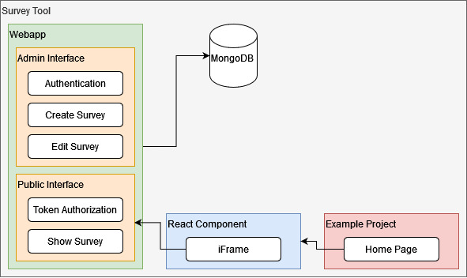

# Survey Tool

This project is split into two individual parts:

1. `survey-tool-webapp`
2. `react-survey-tool`

## survey-tool-webapp

A Next.js website where an admin user can create & edit surveys.

All surveys can be publically accessed, if the request url contains the correct `token` query parameter.

## react-survey-tool

An independent React component created with [nwb](https://github.com/insin/nwb) that renders a fullscreen popup displaying a survey specified with the `surveyLink` prop.

### Exampel Usage

Example usages of the component can be found in `react-survey-tool/demo/src` and in the separate Next.js project `survey-tool-example-usage`, which uses the `react-survey-tool` npm package.

## Architecture

